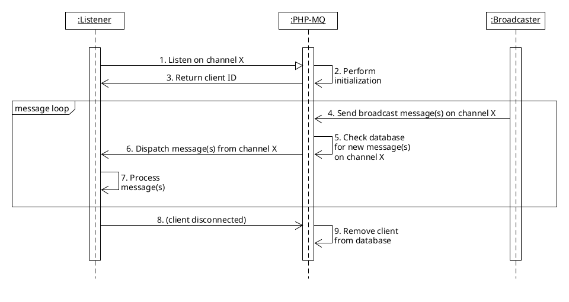

# Architecture

## Prerequisites

Below are the main components involved in this framework:

- PHP server for **your application** (Apache, Nginx, etc)
- Database server for **your application** (MySQL, PostgreSQL, etc)
- PHP server for dedicated **PHP-MQ server** (Apache, Nginx, etc)
- Database server for **PHP-MQ server** (MySQL only)

## Components

- **Your application** consists of broadcaster and listener components.
    * **Broadcaster** is used to send messages on a specified channel.
    * **Listener** is used to poll messages from a specified channel. This usually lies on web browser within `EventSource` object.
- **PHP-MQ server** consists of channel, client, and message components.
    * **Channel** uniquely identifies isolated communication channels, consists of one or more connected clients.
    * **Client** uniquely identifies an active listener on the web browser.
    * **Message** contains data sent by a broadcaster on a specified channel. PHP-MQ will automatically replicate the messages for each client connected to that channel.

## Diagram

Below is the example diagram of a broadcasting system:

### Explanation

1. A listener from your application sends a SSE listen request (can be achieved via `EventSource` object) to the PHP-MQ server. You must supply a channel ID for the messages to be retrieved from.
2. PHP-MQ server will start the daemon process in the background, perform channel, and client initialization. When a channel does not exist, it will be automatically created, so is the client. As an additional action, it will perform cleanup too (clears unused clients and channels in the database).
3. When the client is successfully initialized, PHP-MQ server will return the numeric client ID to the listener in the form of SSE event: `phpmq_client_id`.
4. Broadcaster from your application sends a POST request to PHP-MQ server. You must supply channel ID and message contents. If the channel does not exist, the PHP-MQ server will perform **no actions** (because a channel *is guaranteed* to have one or more clients, so if there's no client listening on that channel, there's no need to send messages).
5. PHP-MQ server will periodically check for new messages on the channel the current client resides in.
6. If there are messages enqueued on the channel for the client, it will be automatically sent by PHP-MQ server to the listener application via SSE event. The server then dequeues all sent messages, removing them from the database.
7. Listener application processes SSE messages sent by PHP-MQ server.
8. When the client disconnects (browser closes), it will signal the PHP-MQ server to stop the daemon process containing that client.
9. The daemon process stops and its corresponding client ID is removed from the database.
